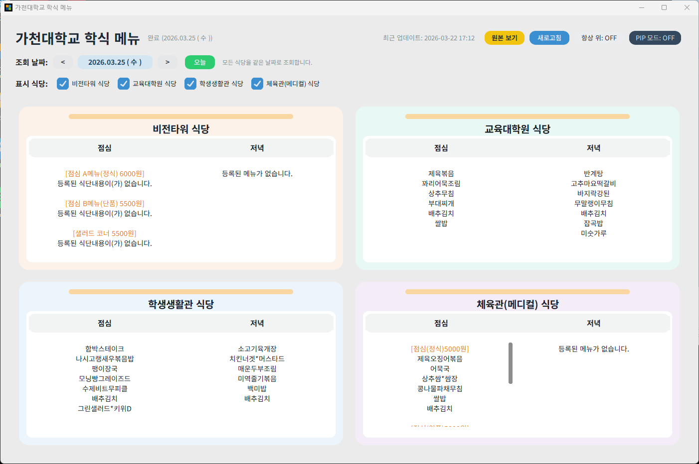

# 가천대학교 학식 메뉴 (Gachon Meal Widget)

가천대학교 학생식당의 메뉴를 데스크톱 화면에서 빠르고 편리하게 확인할 수 있는 Windows 데스크톱 애플리케이션입니다. 번거롭게 매번 웹사이트를 접속할 필요 없이, 위젯 하나로 그날의 식단을 미리 확인하세요.



## 📌 주요 기능 및 특징

- **4개 주요 식당 통합 제공**
  - 비전타워 식당
  - 교육대학원 식당
  - 학생생활관 식당
  - 체육관(메디컬) 식당
- **스마트한 식단 시각화**
  - 점심 / 저녁 메뉴를 직관적으로 분리하여 표시합니다.
  - 당일 배식 정보가 없으면 이전 날짜로 대체하지 않고, 등록된 메뉴 없음으로 안내합니다.
  - 날짜 이동 버튼(`< 날짜 >`)으로 전체 식당을 동일한 날짜 기준으로 조회하며, 주차 경계를 넘어가도 자동으로 이전/다음 주 데이터를 불러옵니다.
- **다양한 사용자 편의 기능**
  - **PIP 모드 (스티키 노트 형태)**: 내가 원하는 식당만 포스트잇처럼 화면 구석에 따로 띄워둘 수 있습니다. (반투명 윈도우 지원 및 창 이동 가능)
  - **항상 위 창 고정**: 메인 창이나 PIP 창을 다른 창들 위에 항상 떠 있도록 고정할 수 있습니다.
  - **선택적 식당 필터링**: UI 상단의 체크박스를 통해 조회하고 싶은 식당만 깔끔하게 시청할 수 있습니다.
  - **원본 페이지 바로가기**: '원본 보기' 버튼 클릭 시 선택된 식당들의 학교 홈페이지 식단표 페이지를 브라우저로 띄워줍니다.
- **자동 최신화**
  - 앱을 켜두기만 하면 30분마다 최신 상태로 새로고침을 진행합니다.
  - 수동 새로고침 버튼 또는 단축키 `F5` 제공.

---

## 🚀 설치 및 사용 안내

### 1) 자동 설치 (가장 권장하는 방법)

프로젝트 폴더 내 위치한 **`install_app.bat`** 파일을 더블클릭하여 실행하세요.
스크립트가 알아서 아래의 작업들을 일괄 수행합니다.

1. `build_exe.bat` 내부 호출을 통해 파이썬 코드를 독립 실행형 `.exe` 파일로 빌드
2. 사용자 PC의 `%LOCALAPPDATA%\Programs\GachonMealWidget` 공간으로 파일 복사 및 설치
3. 바탕화면 바로가기 및 시작 메뉴 아이콘 생성
4. 작업표시줄 고정 자동 시도
5. 설치가 완료되면 위젯을 즉시 실행

> **참고**: 향후 소스 코드 업데이트 시에도 동일하게 `install_app.bat`을 실행해주면 자동으로 덮어쓰기 형태로 최신화가 완료됩니다.

### 2) Python 개발 환경에서 직접 실행

코드를 수정하거나 개발 환경에서 바로 띄워보고 싶을 때는 Python으로 실행합니다.

**요구 환경**
- Windows 운영체제 (내장 `curl` 명령어 사용)
- Python 3.10 이상 권장

```bash
python gachon_meal_widget.py
```

---

## 🗑️ 앱 삭제 및 완전 제거

바탕화면에 설치된 위젯을 더 이상 사용하지 않거나 지우고 싶을 경우, **`uninstall_app.bat`** 파일을 실행해 주세요. 
- 실행 중인 위젯 프로세스를 강제 종료합니다.
- 생성된 바로가기 파일(바탕화면, 시작 메뉴)을 모두 제거합니다.
- 설치된 폴더(`%LOCALAPPDATA%\Programs\GachonMealWidget`) 전체를 깨끗이 삭제합니다.

---

## 📂 파일 구성 안내

- `gachon_meal_widget.py`: 위젯의 핵심 로직 및 UI가 포함된 1코어 소스
- `install_app.bat` / `uninstall_app.bat`: 사용자를 위한 원클릭 설치·제거 스크립트
- `build_exe.bat`: PyInstaller 패키징 스크립트 (가상환경 없이 배포판 생성 목적)
- `pin_taskbar.ps1`: Windows 작업표시줄 고정을 위한 PowerShell 유틸리티
- `assets/images/logo.png` / `assets/images/logo.ico`: 프로그램 아이콘 리소스
- `assets/images/screenshot.png`: README 실행 화면 이미지

---

## ⚠️ 라이선스 및 데이터 정책 사항

- 본 위젯은 사용자의 개인정보나 로그인 계정을 절대 요구하지 않는 정보 조회용 유틸리티 앱입니다.
- 앱에서 보여지는 모든 메뉴 정보는 가천대학교 공식 공개 홈페이지의 식단 페이지 데이터를 기반으로 조회됩니다. 
- 학교 측 홈페이지 구조(HTML)가 변경되거나, 통신 방화벽에 의해 `curl` 모듈이 차단되는 환경에서는 일시적으로 식단 조회가 불가능할 수 있습니다.
